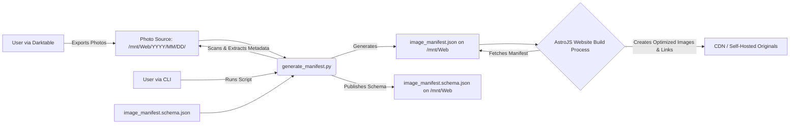

# System Patterns: Photodraft

**Version:** 0.1.3 (Reflects slug field addition)
**Date:** 2025-06-12

## 1. System Architecture Overview

Photodraft is a single Python script (`generate_manifest.py`) that acts as a batch processing tool. It operates on a local filesystem and produces a JSON data file. It's a component in a larger personal media publishing pipeline.

**Key Components & Flow:**

1.  **Photo Storage (`PHOTO_ROOT_DIR`):** A designated root directory (e.g., `/mnt/Web`) where photos are stored, organized by `YYYY/MM/DD/`. This is the primary input source.
2.  **`generate_manifest.py` (The Script):**
    *   **Input:** Path to `PHOTO_ROOT_DIR`.
    *   **Process:**
        *   Recursively walks the directory.
        *   Identifies image files (JPG, JPEG, PNG, WEBP).
        *   For each image:
            *   Opens the image using Pillow.
            *   Extracts dimensions.
            *   Extracts EXIF data using `img._getexif()`.
            *   Attempts to extract XMP data using `img.getxmp()`.
            *   **Generates `slug`:** Creates a URL-friendly slug from the `relativePath` (e.g., `2025/03/04/DSC_1234.jpg` becomes `2025-03-04-DSC_1234`).
            *   **Metadata Prioritization:**
                *   **Title:** XMP `dc:title` -> EXIF `ImageDescription` -> EXIF `ObjectName`.
                *   **Description:** XMP `dc:description` -> EXIF `UserComment` -> EXIF `ImageDescription` (if not used for title).
                *   **Tags:** XMP `dc:subject` -> EXIF `XPKeywords`.
                *   **Creator:** XMP `dc:creator` -> EXIF `Artist`.
                *   **Copyright:** XMP `dc:rights` -> EXIF `Copyright`.
            *   Uses helper functions (`find_in_xmp`, `get_xmp_text_or_list_first`, `get_xmp_lang_alt`) for robust XMP parsing (Bag, Seq, Alt structures).
            *   Cleans and formats extracted data (e.g., date parsing, string cleaning, `IFDRational` to float).
            *   Constructs a Python dictionary representing the image's metadata, including the `slug`.
        *   Collects all image data into a list.
        *   Sorts the list by `dateTaken` (descending).
    *   **Output:** Writes the list of image data as a JSON array to `OUTPUT_JSON_FILE` (e.g., `/mnt/Web/image_manifest.json`).
    *   Can also publish `image_manifest.schema.json` to the output directory via a `just` command.
3.  **`image_manifest.json` (The Manifest File):**
    *   A JSON array of objects, where each object represents an image and its metadata.
    *   The structure is defined by `image_manifest.schema.json`.
    *   This file serves as the data source for the external AstroJS website.
4.  **`image_manifest.schema.json` (Schema File):**
    *   Defines the expected structure and types for `image_manifest.json`.
    *   Includes fields like `title`, `description`, `creator`, `copyright`, and the new `slug` field.
    *   Can be copied to the output directory alongside the manifest.
5.  **External AstroJS Website (Consumer):**
    *   Fetches `image_manifest.json` (and potentially `image_manifest.schema.json` for validation) during its build.
    *   Uses the data to generate HTML pages, image galleries, etc.
    *   Responsible for creating optimized image versions and linking to originals.

## 2. Key Technical Decisions & Patterns

*   **Language & Core Library:** Python with Pillow (PIL Fork).
*   **Slug Generation:** Derived from `relativePath` by removing the file extension and replacing path separators with hyphens.
*   **Metadata Extraction Strategy:**
    *   Direct EXIF access (`_getexif()`).
    *   Direct XMP access (`getxmp()`).
    *   Prioritized extraction logic for key fields (title, description, tags, creator, copyright) favoring XMP sources with EXIF fallbacks.
    *   Helper functions for navigating common XMP structures.
*   **Configuration:** Hardcoded paths (`PHOTO_ROOT_DIR`, `OUTPUT_JSON_FILE`) in the script.
*   **Data Structure:** Python dictionaries serialized to JSON.
*   **Schema Definition:** `image_manifest.schema.json` for output validation and consumer guidance.
*   **File System Interaction:** `os.walk`, `pathlib.Path`.
*   **CLI Arguments:** `argparse` for `--debug-image` and potentially other future commands.
*   **No External Database:** Regenerates manifest from scratch.

## 3. Data Flow & Management

*   **Data Source:** Image files on local filesystem.
*   **Data Processing:** Within `generate_manifest.py`.
*   **Data Output:** `image_manifest.json` and optionally `image_manifest.schema.json` to the output directory.
*   **Data Integrity:** Relies on metadata embedded by tools like Darktable. Script cleans/normalizes some values.
*   **Sorting:** Data sorted by `dateTaken`.

## 4. Error Handling & Logging

*   **Error Handling:**
    *   Main image processing loop: broad `try-except Exception`, prints error, skips image.
    *   `get_exif_data`: broad `try-except Exception`, returns empty dict.
    *   XMP parsing: `try-except AttributeError` and broad `Exception`.
*   **Logging:** `print()` statements. No formal logging framework.

## 5. Task Automation (`justfile`)

*   Includes commands for: `install`, `generate`, `lint`, `format`, `typecheck`, `qa`.
*   **New/Updated Commands:**
    *   `publish-schema`: Copies `image_manifest.schema.json` to the output directory.
    *   `publish`: Runs `generate` then `publish-schema`.
    *   `debug-image <path>`: Runs `generate_manifest.py --debug-image <path>` for detailed metadata output of a single image.

## 6. Future Considerations (from README & previous observations)

*   **Pydantic Integration:** For data modeling, validation, schema generation.
*   **Robust Error Handling & Logging:** More specific errors, formal logging.
*   **Config File:** Externalize settings.
*   **Advanced Metadata Mapping:** More flexible field mapping.
*   **Testing:** Add automated tests.
*   **Performance Optimization:** e.g., reduce redundant image opening.
*   **`clean_exif_string` Verification:** Ensure `value.replace("", "")` correctly handles null characters if that was the original intent.
